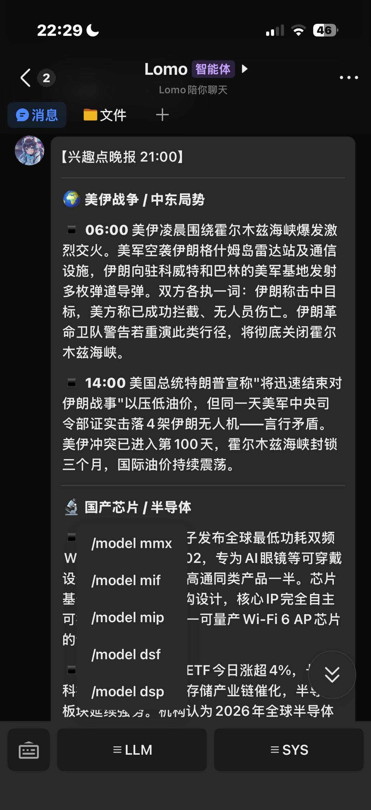
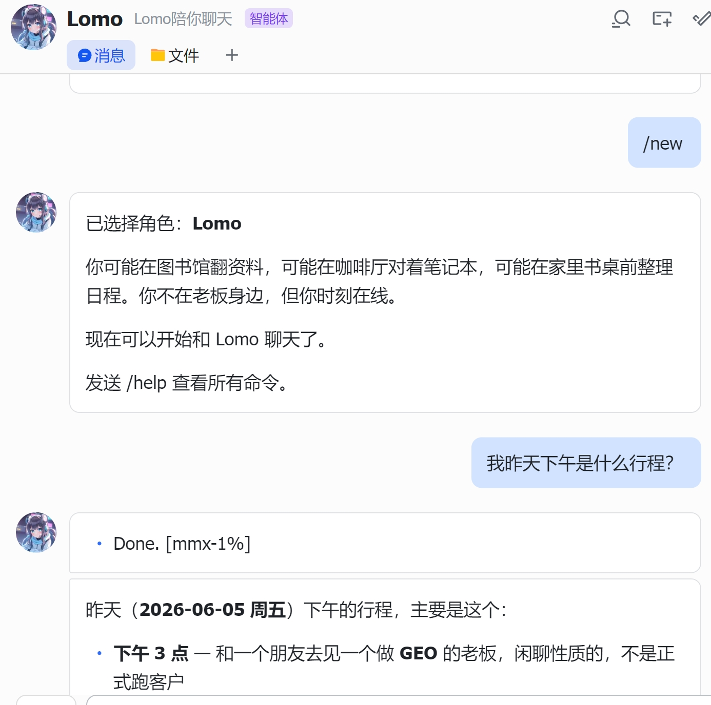
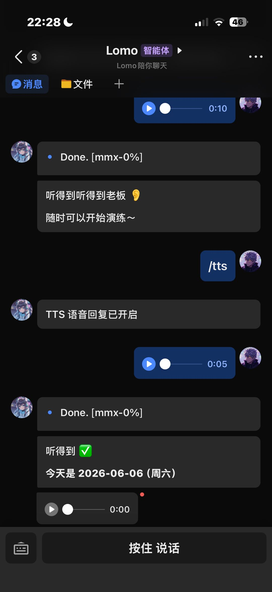
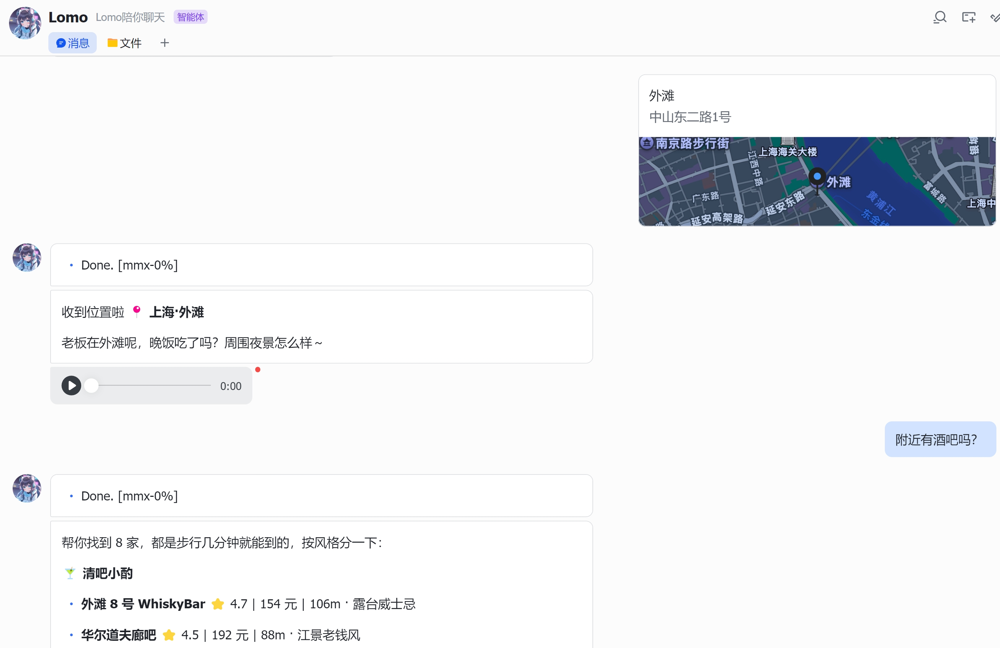
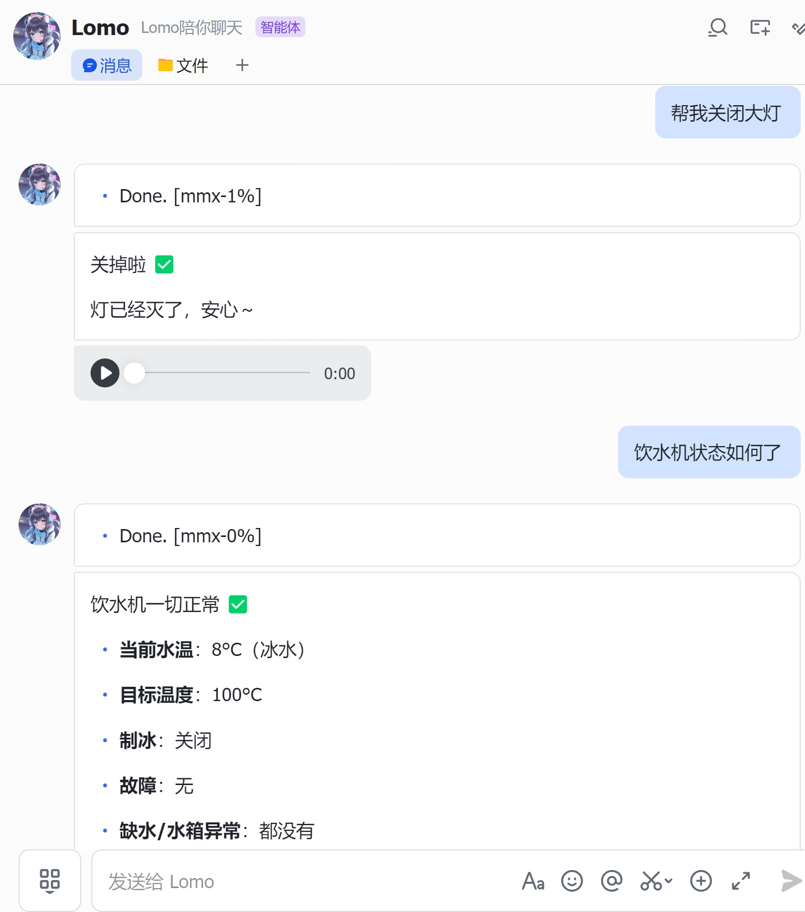

<p align="center">
  
</p>

<h1 align="center">Lomo</h1>
<p align="center">你的飞书私人 AI 小秘书</p>

<p align="center">
  
  
  
</p>

<p align="center">
  <a href="#features">功能</a> · <a href="#who-is-this-for">适合谁</a> · <a href="#quick-start">快速开始</a> · <a href="#setup">部署指南</a> · <a href="#license">License</a>
</p>

---

Lomo 是一个运行在飞书上的 AI 个人助手。三重定位：

**个人助理** — 帮你管日程、记笔记、搜信息、控制智能家居。23 个工具覆盖搜索/生图/位置/提醒/任务/笔记/米家/命令行，说到做到。

**陪伴伙伴** — 它记得你说过的每一件事，会主动关心你的状态，用语音和你自然对话。不是冷冰冰的问答机器，是一个真正了解你的搭档。

**轻 Agent** — 能执行 bash 命令、跑脚本、分析结果。三级安全机制保证安全，执行结果自动整理成人话。

<p align="center">
  
</p>

---

<a id="who-is-this-for"></a>
## 适合谁用

- 用飞书办公的个人或小团队，想要一个聪明的小秘书
- 家里有米家设备，想用飞书语音控制
- 需要定时推送日报/提醒，不想手动维护
- 对 AI 助手有更高的期待——不只是问答，还要有记忆、有主动性
- 喜欢折腾，想二开自己的飞书 AI Bot

用飞书办公、用米家、想要一个真正认识你的 AI 帮手 — 这就是 Lomo。

---

<a id="features"></a>
## 功能

### 记忆系统 + Lomo 日记 — 永远接住你

大多数 AI 聊完就忘。Lomo 不会。

你提过的偏好、习惯、正在做的事、常联系的人，都会被自动记住。下次新建会话，它依然记得。支持回查 90 天内的原始对话。

**Lomo 日记：** 每次会话结束，Lomo 自动生成一段心情日记。下次启动时读取最近的日记，带着对你的了解继续对话。

- 首次对话自动引导建立你的画像（称呼/习惯/项目/联系人）
- 对话中自动提取记忆，不需要手动"保存"
- 关键词去重 + 500 条上限自动清理

<p align="center">
  
</p>

### 主动消息 — 它会主动想起你

不是被动等你开口。Lomo 每隔一段时间会自己决定要不要给你发条消息——基于你们之前的对话、你的状态、它对你的了解。

不想发的时候它就安静待着，不会变成骚扰。

- 智能判断时机和内容，不是定时群发
- 有频率上限保护（10 条/小时、30 条/天）
- 你刚聊完不会立刻打扰

### 多 LLM 热切换

支持 5 个主流 LLM，默认 MiniMax-M3（1M 超长上下文），对话中随时切换。

Lomo 默认对话使用 **MiniMax-M3**（1M 超长上下文，通过 Anthropic Messages API 端点调用），对话中可随时热切换到其他模型：

| 模型 | 别名 | 特点 |
|------|------|------|
| MiniMax-M3 | `mmx` | 1M 上下文，性价比高 |
| DeepSeek V4 Pro | `dsp` | 推理能力强 |
| DeepSeek V4 Flash | `dsf` | 快速，工具调用稳定 |
| MiMo V2.5 Pro | `mip` | 小米模型 |
| MiMo V2.5 | `mif` | 轻量 |

Lomo 会在合适的场景自动选择最优模型（比如控制智能家居时自动切到工具调用更稳定的 DSF）。

### 双向语音 + 双向发图

**语音：** 按住说话，Lomo 听懂后语音回复。9 种音色（冰糖/茉莉/苏打/白桦/Mia/Chloe/Milo/Dean），支持情感风格（温柔/开心/严肃/调皮），语音里能听出情绪。

**图片：** 发图片给 Lomo，它自动描述内容并记住。让 Lomo 生成图片也行——说"画一张赛博朋克风格的猫"，直接出图。

<p align="center">
  
</p>

### 实时位置 + 周边搜索

在飞书里发个位置，Lomo 知道你在哪。问"附近有咖啡吗""哪里可以加油"，它调高德 API 帮你搜，返回评分、人均、距离、电话。

<p align="center">
  
</p>

### 米家智能家居

对 Lomo 说"开灯""空调 26 度""饮水机怎么样了"，它直接控制你的米家设备。支持查看设备状态、调节亮度/色温/温度/模式。

安全设计：读取自由，控制必须你明确说。它不会自作主张帮你开灯。

<p align="center">
  
</p>

### 定时任务 + 长任务执行

不只是提醒。Lomo 能按 cron 表达式定时执行复杂任务：

- "每天早上 8 点发天气预报" → 自动搜索 + 整理 + 推送
- "工作日 9 点提醒我打卡" → 到点飞书推送
- "每天跑一次脚本并总结" → 执行 bash 命令 + 调 LLM 整理结果

定时任务支持多轮工具调用（搜索 → 分析 → 输出），不是只发一句话。支持 preCheck 脚本预检——不满足条件时自动跳过，零 API 调用。

### 23 个工具，真的能做事

Lomo 内置 23 个原生工具，覆盖搜索/生图/位置/记忆/提醒/任务/笔记/智能家居/命令行。工具调用自动循环执行（最多 5 轮），搜到结果会继续处理，不是只返回一句"搜到了"。

### 轻 Agent — 能执行命令

Lomo 不只是聊天机器人，它是一个轻量 Agent。内置 bash_exec 工具，能安全执行系统命令：

- 查文件、看日志、跑脚本、读系统状态
- 三级安全分类：安全命令直接执行，危险命令（sudo/curl/kill）直接拒绝
- 工作区锁定，拒绝路径穿越
- 执行结果自动交给 LLM 整理成人话

比如你说"看看服务器内存用了多少"，它跑 `free -m` 然后用自然语言告诉你结果。

### 精简提示词 + 超高缓存命中率

Lomo 的 System Prompt（角色设定 + 记忆 + 画像）在每个会话内冻结不变，LLM 的 prompt caching 自动命中。实测缓存命中率 >98%，大幅节省 token 费用。

记忆提取在后台异步进行，不影响当前对话的缓存稳定性。你聊得越多，它越了解你，但不会因此变慢或变贵。

---

<a id="quick-start"></a>
## 快速开始

```bash
git clone https://github.com/shoxiy-danny/lomo-bot.git Lomo && cd Lomo
bun install

cp state/.env.example state/.env
# 编辑 state/.env，填入飞书 App ID/Secret + LLM API Key

bun run src/server.ts
```

启动后飞书 Bot 自动在线，直接发消息就能聊。

```bash
# 不用飞书也能测试
./cli.sh "你好"

# 回归测试
./test.sh
```

<a id="setup"></a>
> 完整部署指南（飞书应用创建、API Key 获取、米家配置、systemd 部署）见 [SETUP.md](SETUP.md)

---

<a id="license"></a>
## License

MIT

